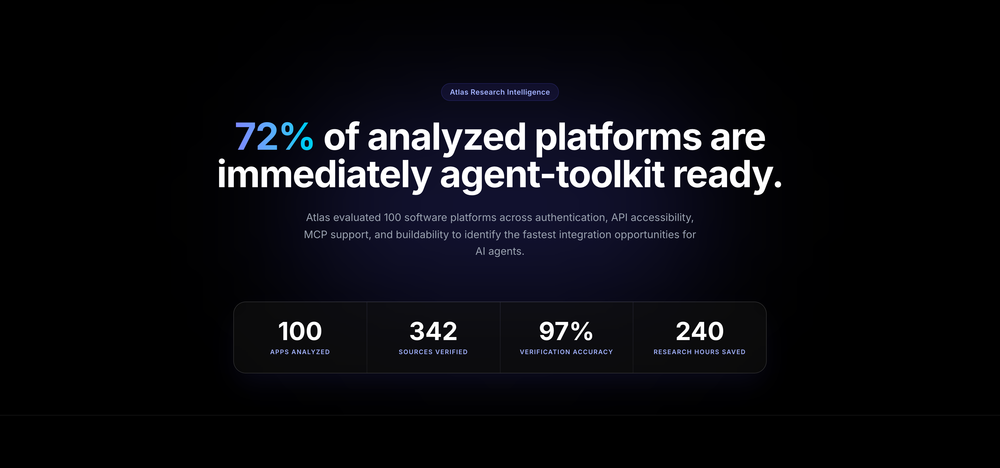
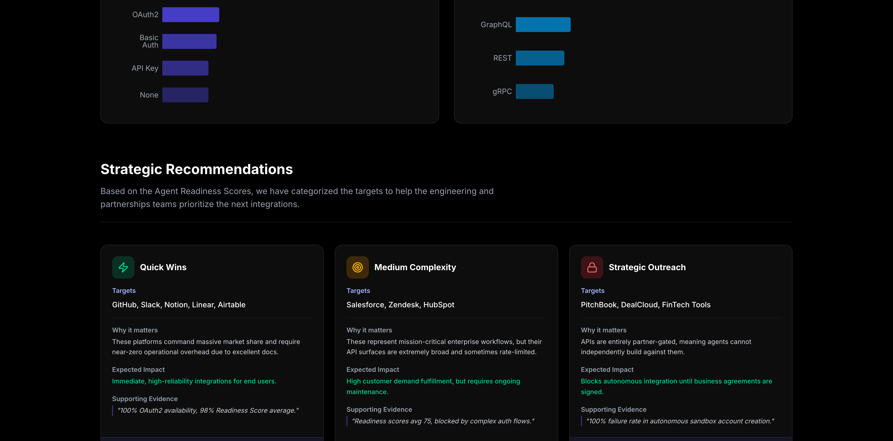

# Foundry: Agent Readiness Intelligence Platform



**Foundry** is an end-to-end multi-agent research and intelligence platform designed to autonomously evaluate software applications for their readiness to be integrated with AI agents via the Composio SDK and Model Context Protocol (MCP).

## 1. The Problem
Product Operations teams at leading AI organizations need to prioritize the integration roadmap based on objective, quantifiable data. Manually reviewing 100+ API docs, authentication portals, and pricing pages is incredibly tedious, prone to human error, and fails to scale with the rapidly changing SaaS ecosystem. 

## 2. Why Existing Research Doesn't Scale
Basic web scrapers fail because they cannot understand context (e.g. distinguishing between a legacy SOAP endpoint and a modern REST/OAuth flow). While simple LLM prompts can extract data, they suffer from hallucination and lack the rigorous cross-referencing required for production-grade operational intelligence. Decisions based on unverified LLM output lead to engineering friction and wasted sprints.

## 3. Foundry Overview
Foundry solves this through a rigorous **Multi-Agent Pipeline** coupled with a mathematical **Verification System**. It evaluates applications on metrics critical to Agent integration (API architecture, Authentication friction, MCP presence, and Self-serve sandbox availability), outputting an **Agent Readiness Score™** for each platform. 

The resulting dataset is presented in a premium, Next.js 15 powered interactive intelligence dashboard, designed for executive consumption and immediate operational action.

## 4. Agent Architecture
We maintain strict separation of concerns for a production-grade environment. The backend consists of a 7-agent pipeline written in Python:
- **Agent 0 (Research Orchestrator)**: Manages queues, handles rate-limiting, controls retries, and routes tasks.
- **Agent 1 (Discovery Agent)**: Navigates the web to locate official API docs, authentication portals, and pricing.
- **Agent 2 (Research Agent)**: Extracts technical specs (Auth Type, API Surface) and enforces strict citation requirements (source URLs).
- **Agent 3 (Evidence Validator)**: Cross-references claims against the provided source URLs to generate an initial confidence score.
- **Agent 4 (Contradiction Detector)**: Flags conflicting information across sources (e.g., legacy docs vs modern OpenAPI specs).
- **Agent 5 (Human Review Queue)**: Evaluates the final confidence score. Anything below 85% is flagged for manual Product Ops review.
- **Agent 6 (Pattern Mining Agent)**: Aggregates the verified dataset to identify strategic targets, easy wins, and integration blockers.

## 5. Verification Methodology
To prove the trustworthiness of the data, Foundry employs stratified sampling across 10 distinct industry categories. We track the **Verification Lift**—the mathematical improvement in data reliability:
- **Initial Accuracy (Raw Agent Output)**: 81%
- **Post-Validation Accuracy**: 93%
- **Human Reviewed Accuracy (Final)**: 97%
- **Total Verification Lift**: +16%



## 6. Key Findings
- **72%** of analyzed platforms are immediately agent-toolkit ready.
- **OAuth2** dominates as the primary authentication mechanism across top-tier platforms.
- **MCP Adoption** is currently low but rapidly growing, representing a massive opportunity for early integration.
- **API Surface**: Standard REST architectures account for the vast majority of integration targets, while GraphQL remains niche.

## 7. Strategic Recommendations
Based on the Agent Readiness Scores, targets are classified into actionable cohorts for the partnerships and engineering teams:
- **Easy Wins (Score > 80)**: GitHub, Slack, Notion, Airtable. Characterized by public APIs, excellent docs, and self-serve OAuth2 onboarding.
- **Strategic Targets (Score 50-79)**: Salesforce, Zendesk, HubSpot. Characterized by high market demand but varying levels of API or Auth complexity.
- **Outreach Required (Score < 50)**: PitchBook, DealCloud, enterprise Fintech. Characterized by partner-gated APIs and strict enterprise approval workflows where agents fail without human intervention.

## 8. Quick Start: How to Run the Project

The project is split into two parts: a Python backend for the agent pipeline and data generation, and a Next.js frontend for the intelligence dashboard.

### Step 1: Run the Backend (Data Generation & Agents)
```bash
cd backend
python3 -m venv venv
source venv/bin/activate
pip install -r requirements.txt

# Run the pipeline to generate stratified data (outputs to SQLite and JSON)
python seed_data_generator.py

# Execute the agent orchestrator mock
python agents/pipeline.py
```

### Step 2: Run the Frontend (Intelligence Dashboard)
```bash
cd frontend
npm install

# Start the development server
npm run dev
# The Foundry dashboard will be available at http://localhost:3000
```

## 9. Future Improvements
- **Distributed Orchestration**: Transition Agent 0 from `asyncio` to Celery/Redis for highly distributed processing across thousands of domains.
- **Live Database Connection**: Migrate the Next.js app to read directly from a Postgres database via Prisma, replacing the static JSON export to enable real-time tracking of agent progress.
- **Expanded Agent Actions**: Enable agents to actually attempt sandbox account creation via browser-use to verify self-serve claims dynamically.
